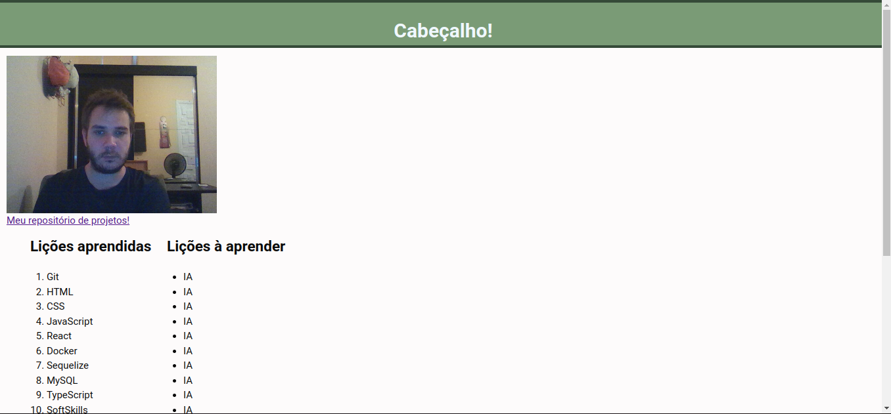

# Projeto Lessons Lerned

  
## Descrição  

Olá, possível recrutador!
Bem-vindo ao meu repositório do projeto de Lições Aprendidas.  
Este é o meu PRIMEIRO trabalho entregável na Trybe. Trata-se de uma estrutura básica em HTML   
com informações do meu currículo. Nosso primeiro contato com HTML e CSS

## Sobre o Projeto

Este projeto foi desenvolvido como parte do meu aprendizado na Trybe. É um site que contém uma série de informações(fictícias) sobre o que aprendi ao longo dos últimos três blocos do curso. O site está estruturado e estilizado, com elementos posicionados e semântica apropriada para melhor acessibilidade e ranqueamento.

## Como executar o projeto localmente

Caso queira executar o projeto localmente, siga as instruções abaixo:

1. Clone este repositório em sua máquina local  
2. Abra o arquivo `index.html` em seu navegador de preferência para visualizar o currículo online.

## Sobre meu aprendizado

Neste projeto, tive a oportunidade de aprender e aplicar diversos conceitos de HTML e CSS. Fique à vontade para explorar o código e conhecer um pouco mais sobre minhas habilidades e conhecimentos adquiridos até o momento.

## Contato

Vamos expandir nossa Network e compatilhar experiências?  
Caso tenha interesse em entrar em contato comigo, fique à vontade para me enviar uma mensagem pelo [LinkedIn](https://www.linkedin.com/in/felipe-matos-vqv/) ou pelo meu e-mail: felipe.mbarbosa.dev@gmail.com

## LinkedIn https://www.linkedin.com/in/felipe-matos-vqv/
## email felipe.mbarbosa.dev@gmail.com

Obrigado pela visita e pelo interesse em conhecer o meu trabalho!

Atenciosamente,  
Felipe Matos

